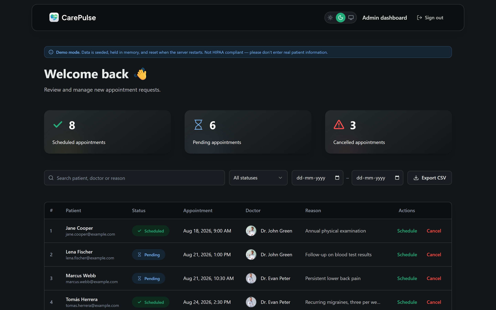
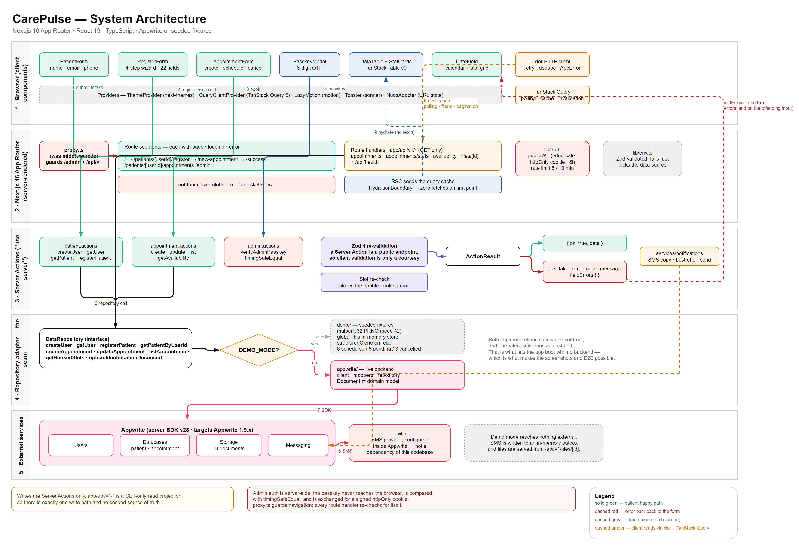
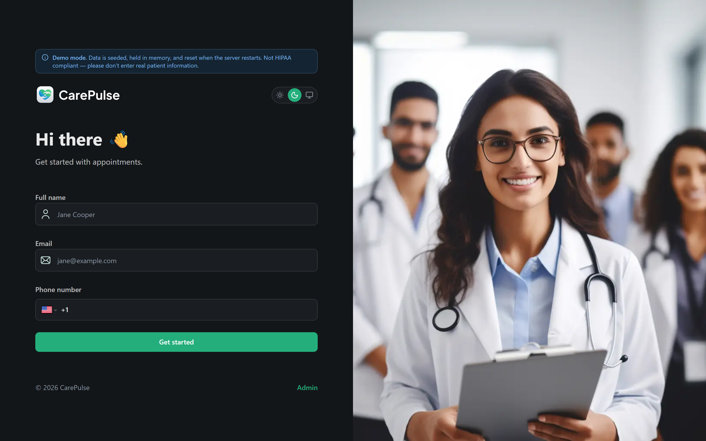
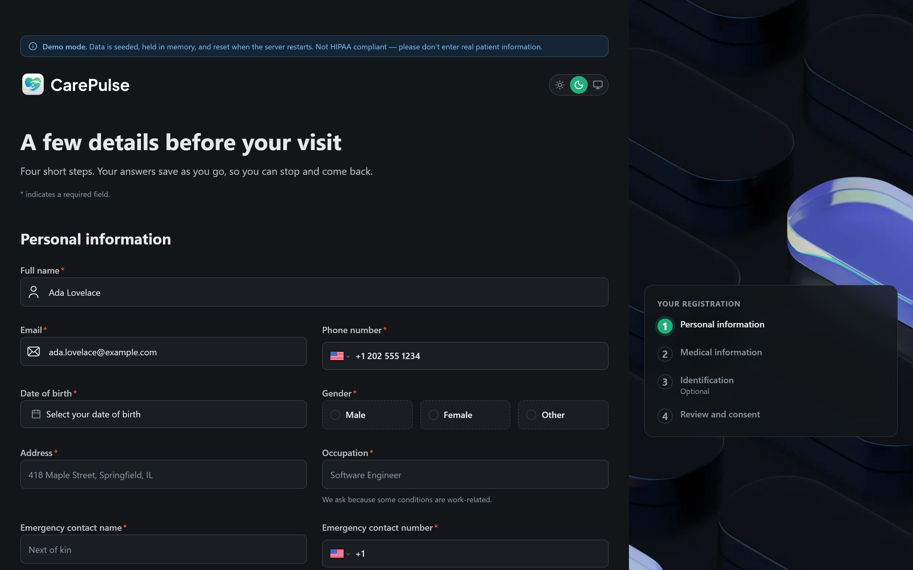
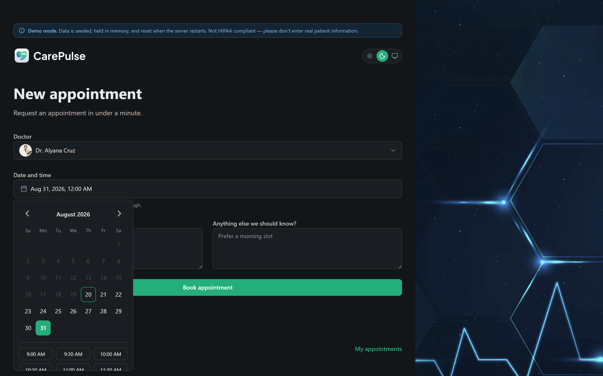
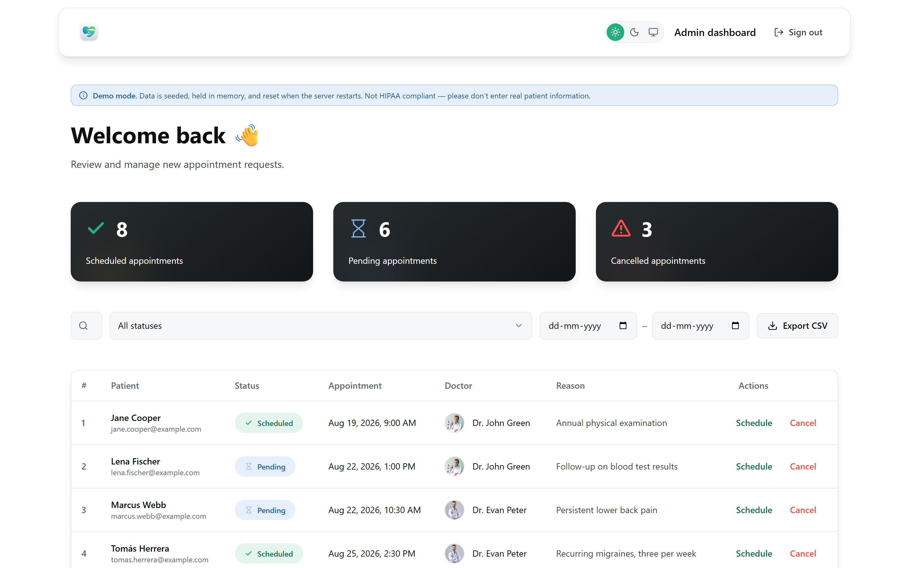
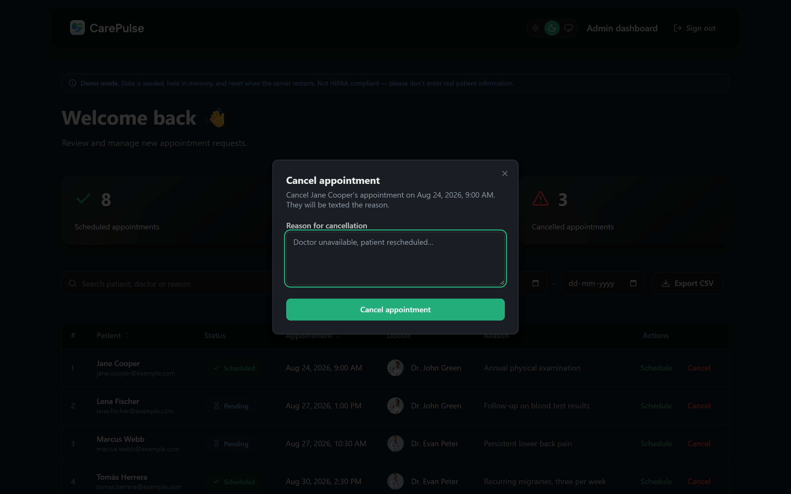
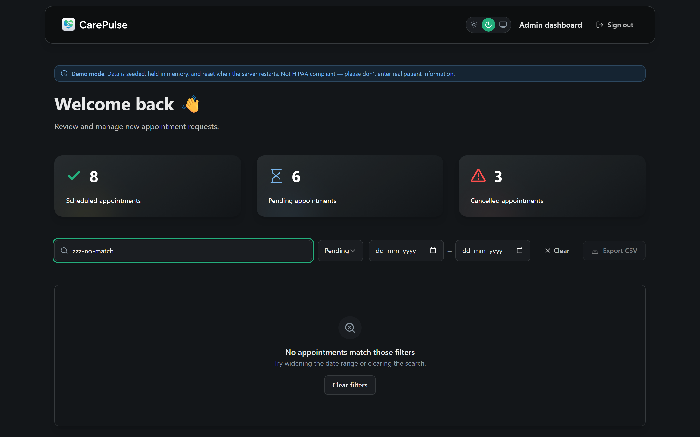

<a id="readme-top"></a>

[![Contributors][contributors-shield]][contributors-url]
[![Forks][forks-shield]][forks-url]
[![Stargazers][stars-shield]][stars-url]
[![Issues][issues-shield]][issues-url]
[![MIT License][license-shield]][license-url]
[![LinkedIn][linkedin-shield]][linkedin-url]

<div align="center">
  <h1>CarePulse</h1>
  <p><b>Patient intake and appointment management for small clinics — book, review, and schedule in one place.</b></p>
  <p>
    <a href="https://github.com/omunite215/Project_CarePulse/issues/new?labels=bug">Report Bug</a>
    &nbsp;·&nbsp;
    <a href="https://github.com/omunite215/Project_CarePulse/issues/new?labels=enhancement">Request Feature</a>
  </p>
</div>

<details>
  <summary>Table of Contents</summary>
  <ol>
    <li><a href="#about-the-project">About The Project</a>
      <ul><li><a href="#built-with">Built With</a></li></ul>
    </li>
    <li><a href="#features">Features</a></li>
    <li><a href="#getting-started">Getting Started</a>
      <ul>
        <li><a href="#prerequisites">Prerequisites</a></li>
        <li><a href="#installation">Installation</a></li>
      </ul>
    </li>
    <li><a href="#usage">Usage</a></li>
    <li><a href="#roadmap">Roadmap</a></li>
    <li><a href="#contributing">Contributing</a></li>
    <li><a href="#license">License</a></li>
    <li><a href="#contact">Contact</a></li>
    <li><a href="#acknowledgments">Acknowledgments</a></li>
  </ol>
</details>

## About The Project

<p align="center"></p>

CarePulse handles the two things a small clinic does constantly: getting a new patient on the books, and managing the appointments that result. A patient enters their name, email and phone, works through a four-step medical registration, and picks a slot from their doctor's real availability. Staff open a passkey-gated dashboard to see every request, then confirm or cancel it — and the patient gets a text either way.

It runs with no backend at all. Clone it, install, and `pnpm dev` boots against seeded in-memory fixtures, so every screen in this README is reachable in about thirty seconds. Point the Appwrite environment variables at a real project and the same code talks to Appwrite instead; the swap happens behind one repository interface, and the same test suite covers both.

This is a portfolio build, not a compliance-audited clinical system. It is not HIPAA compliant and should not hold real patient data.

<p align="right">(<a href="#readme-top">back to top</a>)</p>

### Built With

[![Next][Next-badge]][Next-url] [![React][React-badge]][React-url] [![TypeScript][TS-badge]][TS-url]
[![Tailwind][TW-badge]][TW-url] [![shadcn/ui][Shadcn-badge]][Shadcn-url] [![Radix][Radix-badge]][Radix-url]
[![Zod][Zod-badge]][Zod-url] [![React Hook Form][RHF-badge]][RHF-url] [![TanStack Query][TSQ-badge]][TSQ-url]
[![Motion][Motion-badge]][Motion-url] [![Appwrite][Appwrite-badge]][Appwrite-url] [![Twilio][Twilio-badge]][Twilio-url]
[![Vitest][Vitest-badge]][Vitest-url] [![Playwright][PW-badge]][PW-url] [![pnpm][pnpm-badge]][pnpm-url]

<p align="center"></p>

Five layers, one seam. Client components talk to Server Actions for every write; `app/api/v1/*` is a GET-only read projection that TanStack Query polls through xior. Both meet at a single `DataRepository` interface, behind which sits either Appwrite or the seeded fixtures — which is what lets the whole thing run offline.

The diagram source is committed at [`docs/architecture.drawio`](docs/architecture.drawio); regenerate the PNG with `pnpm diagram`.

<p align="right">(<a href="#readme-top">back to top</a>)</p>

## Features

**Patient**

- Three-field onboarding that resumes instead of failing when an email is already registered
- Four-step registration wizard — personal, medical, identification, review and consent — covering 22 validated fields, with each step validated before it will advance
- Step state lives in the URL, so browser back and forward, and a mid-form reload, all land where you left off
- Required-field markers are derived from the Zod schema rather than hand-maintained, so they cannot drift from what is actually validated
- Validation on blur, with character counters and inline help on the long free-text answers, and a step indicator over the hero image
- A pre-submit review of every answer, each with a link back to the step that owns it
- A failed submit raises an error summary that routes to the step holding the first error and moves focus there
- Date-of-birth picker with month and year dropdowns — reaching 1990 previously took around 430 chevron clicks
- Drag-and-drop upload for an identification document, with type and size checks and a live preview
- Draft autosave to `localStorage`, deliberately excluding the ID number and the document itself
- Appointment booking with a calendar and a time-slot grid showing the chosen doctor's real availability
- Slots already taken are struck through, and the server re-checks on submit to close the double-booking race
- A confirmation page, plus a "My appointments" view for self-serve reschedule and cancel

**Admin**

- Six-digit passkey gate; the passkey is compared server-side and exchanged for a signed httpOnly cookie
- Rate limited to five attempts per ten minutes, with `timingSafeEqual` comparison
- Dashboard with scheduled / pending / cancelled counts across every appointment
- Paginated table on TanStack Table v9, hydrated from the server so first paint makes zero API calls
- Search, status filter and date-range filter held in the URL, so a filtered view is shareable and survives a refresh
- Per-row confirm and cancel dialogs; the patient is texted on both, and a failed SMS is reported rather than hidden
- CSV export of the current page, with formula-injection escaping

**Platform**

- Demo mode: seeded fixtures, no backend required, deterministic across runs
- Light and dark themes that both actually work, with system as a third option
- Loading, error, empty and offline states on every route — skeletons match the real layout, so nothing shifts
- Server-validated forms; field-level errors map back onto the offending input and move focus there
- WCAG AA contrast, visible focus rings, a skip link, and `prefers-reduced-motion` respected throughout
- 139 unit tests and 36 end-to-end browser tests, plus a reproducible 20-shot screenshot suite

<details>
<summary>More screenshots</summary>

| | |
|---|---|
|  |  |
| Onboarding | Registration |
|  |  |
| Slot picker with availability | Dashboard, light theme |
|  |  |
| Cancel dialog | Filtered empty state |

</details>

<p align="right">(<a href="#readme-top">back to top</a>)</p>

## Getting Started

### Prerequisites

- **Node.js 20.9 or newer** (Next 16 requires it)
- **pnpm** — `npm install -g pnpm`

Nothing else. An Appwrite project and a Twilio number are optional and only needed for live mode.

### Installation

```bash
git clone https://github.com/omunite215/Project_CarePulse.git
cd Project_CarePulse
pnpm install
pnpm dev
```

Open <http://localhost:3000>. With no `.env.local` present the app detects that Appwrite is unconfigured and runs against seeded fixtures.

To point it at a real backend, copy the example file and fill it in:

```bash
cp .env.example .env.local
```

```ini
NEXT_PUBLIC_ENDPOINT=https://cloud.appwrite.io/v1
PROJECT_ID=
API_KEY=
DATABASE_ID=
PATIENT_COLLECTION_ID=
APPOINTMENT_COLLECTION_ID=
NEXT_PUBLIC_BUCKET_ID=

ADMIN_PASSKEY=123456
ADMIN_SESSION_SECRET=
```

Set the Appwrite variables all together or not at all — a partial configuration fails at boot rather than silently falling back to fixtures. `node-appwrite` 28 targets Appwrite Server 1.9.x. SMS goes through Appwrite Messaging, with Twilio configured as the provider inside the Appwrite console, so there is no `twilio` dependency here.

<p align="right">(<a href="#readme-top">back to top</a>)</p>

## Usage

**As a patient** — from `/`, enter a name, email and phone. You land on registration; work through the four steps, check the review summary and submit. Pick a doctor and the calendar will show that doctor's free slots, with taken ones struck through. Book, and you get a confirmation page. `/patients/<id>/appointments` lists everything you have booked and lets you reschedule or cancel.

**As staff** — click **Admin** in the footer, or go to `/?admin=true`. The demo passkey is `123456`. The dashboard shows counts and the full appointment table; filter it, export the page as CSV, and use **Schedule** or **Cancel** on any row. Both text the patient, and the toast tells you whether the message actually sent.

In demo mode the data lives in memory and resets when the server restarts. SMS is written to an in-memory outbox rather than sent. Reads are delayed by `DEMO_LATENCY_MS` (600ms by default) so the loading skeletons are visible rather than theoretical — set `DEMO_LATENCY_MS=0` for an instant demo. Writes are never delayed.

**Scripts**

```bash
pnpm dev         # dev server
pnpm build       # production build
pnpm start       # serve the production build
pnpm lint        # oxlint
pnpm typecheck   # tsc --noEmit
pnpm test        # Vitest unit + repository contract tests
pnpm e2e         # Playwright end-to-end suite
pnpm check       # lint + typecheck + test
```

**Regenerating assets**

```bash
pnpm shots             # rewrites public/screenshots/ from a live build
pnpm shots:responsive  # 63-capture breakpoint audit, tests/responsive-shots.spec.ts
pnpm diagram           # exports docs/architecture.drawio to PNG (needs draw.io desktop)
```

<p align="right">(<a href="#readme-top">back to top</a>)</p>

## Roadmap

- [x] Demo mode with seeded fixtures, so the app runs with no backend
- [x] Server-side admin auth with a signed cookie and rate limiting
- [x] Time-slot picker with server-side double-booking prevention
- [x] Patient self-serve reschedule and cancel
- [x] URL-driven admin filters and CSV export
- [x] Working light/dark themes and a WCAG AA pass
- [x] Four-step registration wizard with per-step validation, URL step state and a pre-submit review
- [ ] Sortable admin table columns, exposing the sort the read API already supports
- [ ] Doctor availability managed in the admin UI rather than fixed clinic hours
- [ ] Appointment volume chart on the dashboard
- [ ] Email notifications alongside SMS
- [ ] Bulk row actions and a printable appointment summary
- [ ] Audit log of admin actions
- [ ] PWA offline shell
- [ ] Internationalisation

Explicitly out of scope: real patient authentication, HIPAA compliance, payments, and telehealth video.

See the [open issues](https://github.com/omunite215/Project_CarePulse/issues) for a full list of proposed features and known issues.

<p align="right">(<a href="#readme-top">back to top</a>)</p>

## Contributing

Contributions make the open-source community a great place to learn and build. Any contributions you make are **greatly appreciated**.

1. Fork the project
2. Create your feature branch (`git checkout -b feature/amazing-feature`)
3. Commit your changes (`git commit -m 'Add amazing feature'`)
4. Push to the branch (`git push origin feature/amazing-feature`)
5. Open a pull request

Run `pnpm check` before opening a PR.

<p align="right">(<a href="#readme-top">back to top</a>)</p>

## License

Distributed under the MIT License. See [`LICENSE`](LICENSE) for more information.

<p align="right">(<a href="#readme-top">back to top</a>)</p>

## Contact

Om Patel

[![GitHub][github-shield]][github-url]
[![LinkedIn][linkedin-shield]][linkedin-url]
[![Instagram][instagram-shield]][instagram-url]
[![Portfolio][portfolio-shield]][portfolio-url]
[![Email][email-shield]][email-url]

Project link: [https://github.com/omunite215/Project_CarePulse](https://github.com/omunite215/Project_CarePulse)

<p align="right">(<a href="#readme-top">back to top</a>)</p>

## Acknowledgments

- [JavaScript Mastery](https://www.youtube.com/watch?v=lEflo_sc82g) — the CarePulse tutorial this project grew out of
- [Hombre2014/carepulse](https://github.com/Hombre2014/carepulse) — reference for the original feature set
- [shadcn/ui](https://ui.shadcn.com) and [Radix UI](https://www.radix-ui.com)
- [Appwrite](https://appwrite.io)
- [Best README Template](https://github.com/othneildrew/Best-README-Template)
- [Shields.io](https://shields.io)
- [Img Shields](https://simpleicons.org) for tech-stack logos

<p align="right">(<a href="#readme-top">back to top</a>)</p>

<div align="center">
  <br />
  
  <p><sub>Built by Om Patel</sub></p>
</div>

[contributors-shield]: https://img.shields.io/github/contributors/omunite215/Project_CarePulse.svg?style=for-the-badge
[contributors-url]: https://github.com/omunite215/Project_CarePulse/graphs/contributors
[forks-shield]: https://img.shields.io/github/forks/omunite215/Project_CarePulse.svg?style=for-the-badge
[forks-url]: https://github.com/omunite215/Project_CarePulse/network/members
[stars-shield]: https://img.shields.io/github/stars/omunite215/Project_CarePulse.svg?style=for-the-badge
[stars-url]: https://github.com/omunite215/Project_CarePulse/stargazers
[issues-shield]: https://img.shields.io/github/issues/omunite215/Project_CarePulse.svg?style=for-the-badge
[issues-url]: https://github.com/omunite215/Project_CarePulse/issues
[license-shield]: https://img.shields.io/github/license/omunite215/Project_CarePulse.svg?style=for-the-badge
[license-url]: https://github.com/omunite215/Project_CarePulse/blob/main/LICENSE

[github-shield]: https://img.shields.io/badge/GitHub-181717?style=for-the-badge&logo=github&logoColor=white
[github-url]: https://github.com/omunite215
[linkedin-shield]: https://img.shields.io/badge/LinkedIn-0A66C2?style=for-the-badge&logo=linkedin&logoColor=white
[linkedin-url]: https://www.linkedin.com/in/om-patel-ai
[instagram-shield]: https://img.shields.io/badge/Instagram-E4405F?style=for-the-badge&logo=instagram&logoColor=white
[instagram-url]: https://www.instagram.com/_21omp/
[portfolio-shield]: https://img.shields.io/badge/Portfolio-000000?style=for-the-badge&logo=vercel&logoColor=white
[portfolio-url]: https://portfolio-jade-gamma-13.vercel.app
[email-shield]: https://img.shields.io/badge/Email-EA4335?style=for-the-badge&logo=gmail&logoColor=white
[email-url]: mailto:omunite21@gmail.com

[Next-badge]: https://img.shields.io/badge/Next.js%2016-000000?style=for-the-badge&logo=nextdotjs&logoColor=white
[Next-url]: https://nextjs.org
[React-badge]: https://img.shields.io/badge/React%2019-20232A?style=for-the-badge&logo=react&logoColor=61DAFB
[React-url]: https://react.dev
[TS-badge]: https://img.shields.io/badge/TypeScript-3178C6?style=for-the-badge&logo=typescript&logoColor=white
[TS-url]: https://www.typescriptlang.org
[TW-badge]: https://img.shields.io/badge/Tailwind%20v4-06B6D4?style=for-the-badge&logo=tailwindcss&logoColor=white
[TW-url]: https://tailwindcss.com
[Shadcn-badge]: https://img.shields.io/badge/shadcn%2Fui-000000?style=for-the-badge&logo=shadcnui&logoColor=white
[Shadcn-url]: https://ui.shadcn.com
[Radix-badge]: https://img.shields.io/badge/Radix%20UI-161618?style=for-the-badge&logo=radixui&logoColor=white
[Radix-url]: https://www.radix-ui.com
[Zod-badge]: https://img.shields.io/badge/Zod%204-3E67B1?style=for-the-badge&logo=zod&logoColor=white
[Zod-url]: https://zod.dev
[RHF-badge]: https://img.shields.io/badge/React%20Hook%20Form-EC5990?style=for-the-badge&logo=reacthookform&logoColor=white
[RHF-url]: https://react-hook-form.com
[TSQ-badge]: https://img.shields.io/badge/TanStack%20Query-FF4154?style=for-the-badge&logo=reactquery&logoColor=white
[TSQ-url]: https://tanstack.com/query
[Motion-badge]: https://img.shields.io/badge/Motion-0055FF?style=for-the-badge&logo=framer&logoColor=white
[Motion-url]: https://motion.dev
[Appwrite-badge]: https://img.shields.io/badge/Appwrite-FD366E?style=for-the-badge&logo=appwrite&logoColor=white
[Appwrite-url]: https://appwrite.io
[Twilio-badge]: https://img.shields.io/badge/Twilio-F22F46?style=for-the-badge&logo=twilio&logoColor=white
[Twilio-url]: https://www.twilio.com
[Vitest-badge]: https://img.shields.io/badge/Vitest-6E9F18?style=for-the-badge&logo=vitest&logoColor=white
[Vitest-url]: https://vitest.dev
[PW-badge]: https://img.shields.io/badge/Playwright-2EAD33?style=for-the-badge&logo=playwright&logoColor=white
[PW-url]: https://playwright.dev
[pnpm-badge]: https://img.shields.io/badge/pnpm-F69220?style=for-the-badge&logo=pnpm&logoColor=white
[pnpm-url]: https://pnpm.io
